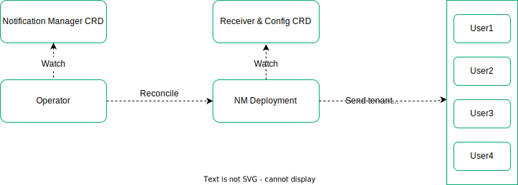
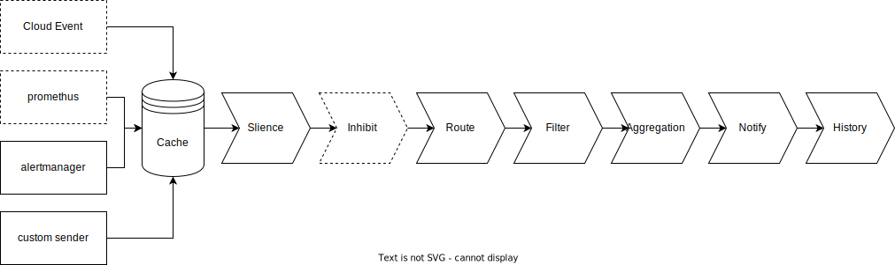

# Notification Manager

## Overview

Notification Manager manages notifications in multi-tenant K8s environment. It receives alerts, cloud event, and others (such as auditing, k8s events) 
from different senders and then send notifications to various tenant receivers based on tenant label like `namespace` or `user`. 

Supported senders includes:
- Prometheus Alertmanager
- Custom sender
- Prometheus  (Coming soon)
- Cloud Event  (Coming soon)

Supported receivers includes:
- [DingTalk](https://www.dingtalk.com/en)
- Email
- [Feishu](https://www.feishu.cn/en/)  
- [Pushover](https://pushover.net/)
- SMS (Short Message Service)  
- [Slack](https://slack.com/) 
- Webhook 
- [WeCom](https://work.weixin.qq.com/)

## Architecture

Notification Manager uses [Receiver](docs/crds/receiver.md) and [Config](docs/crds/config.md) CRDs to store notification configs
like email, WeCom and slack. It also includes an operator to create and reconcile [NotificationManager](docs/crds/notification-manager.md)
CRD which watches all [receivers](docs/crds/receiver.md) and [configs](docs/crds/config.md), updates notification settings accordingly and sends notifications to users.



## Process

The incoming data (alert, cloud event and others) will cache in the cache firstly, then goes through steps such as [silence](#silence), inhibit (coming soon), [route](#route), 
[filter](#filter), [aggregation](#aggregation), etc. Notifications will generate from data using [template](#customize-template), 
then send to receivers and [history webhook](#history) (if set).



### Silence

`Silence` is a straightforward way to simply mute notifications for a given time. It uses [Silence](docs/crds/silence.md) CRD to define
the silence policy. If incoming data matches an active silence, no notifications will be sent out for that data.

### Route

`Route` find all receivers the notifications will send to.
There are two ways to determine which receivers the notifications will send to, one is via [Router](docs/crds/router.md) CRD, 
and the other is auto-matching via the `namespace` label in the notification.

Usually the incoming data contains a `namespace` label, Notification Manager uses this label to decide which receiver to use for sending notifications:
- For KubeSphere, Notification Manager will try to find tenants with the right to access the namespace from [sidecar](docs/crds/notification-manager.md#tenant-sidecar)
  and then find receivers with `user = xxx` label.
- For Kubernetes, Notification Manager will try to find receivers with `namespace = xxx` label.

For data without a `namespace` label, for example alerts of node or kubelet, user can set up a receiver with `type = global` label to receive notifications without a `namespace` label. A global receiver sends notifications for all notifications received regardless any label. A global receiver usually set for an admin role.

How the two methods work together is determined by the [routePolicy](docs/crds/notification-manager.md#RoutePolicy).

### Filter

`Filter` filter the notifications sent to receivers. There are two ways to filter notifications. One is using [alertSelector](docs/crds/receiver.md#notification-filter) in the receiver,
the other is using [tenant silence](docs/crds/silence.md).

### Aggregation

`Aggregation` will group notifications by [groupLabels](docs/crds/notification-manager.md#grouplabels). Notifications in the same group will send together.

### History

`History` is a webhook used to collect all notifications that sent to receivers, it can be set via [history](docs/crds/notification-manager.md#history).

## QuickStart

### Install

We assume you already have a Kubernetes cluster (v1.16+). If you don't, you can install one use [KubeKey](https://github.com/kubesphere/kubekey).

#### Install with yaml

```shell
# Deploy CRDs and the Notification Manager Operator:
kubectl apply -f https://raw.githubusercontent.com/kubesphere/notification-manager/v1.4.0/config/bundle.yaml
# Deploy default template:
kubectl apply -f https://raw.githubusercontent.com/kubesphere/notification-manager/v1.4.0/config/samples/template.yaml
# Deploy built-in language packs. If you don't use Chinese notification you can skip this.
kubectl apply -f https://raw.githubusercontent.com/kubesphere/notification-manager/master/config/i18n/zh-cn.yaml
```

#### Install with helm

```shell
helm install notification-manager helm --create-namespace -n kubesphere-monitoring-system
```

### Configure NotificationManager 

[NotificationManager](docs/crds/notification-manager.md) CRD Defines the desired notification manager webhook deployment. The Notification Manager Operator 
ensures a deployment meeting the resource requirements is running. 

We should create a NotificationManager CR first, skip this when using helm install.

```shell
kubectl apply -f https://raw.githubusercontent.com/kubesphere/notification-manager/master/config/samples/notification_manager.yaml
```

### Configure sender

Notification Manager uses port `19093` and API path `/api/v2/alerts` to receive alerts sent from Alertmanager.

#### Config Alertmanager to send alerts to Notification Manager

To receive Alertmanager alerts, add webhook config like below to the `receivers` section of Alertmanager configuration file:

```shell
    "receivers":
     - "name": "notification-manager"
       "webhook_configs":
       - "url": "http://notification-manager-svc.kubesphere-monitoring-system.svc:19093/api/v2/alerts"
```

#### Customize sender

The data structure passed to notification manager likes this, more information see [Data](https://github.com/kubesphere/notification-manager/blob/master/pkg/template/types.go#L12).

```yaml
{
  "alerts": [
    {
      "status": "firing",
      "labels": {
        "alertname": "KubePodCrashLooping",
        "container": "busybox-3jb7u6",
        "instance": "10.233.71.230:8080",
        "job": "kube-state-metrics",
        "namespace": "pp1",
        "pod": "dd1-0",
        "prometheus": "kubesphere-monitoring-system/k8s",
        "severity": "critical"
      },
      "annotations": {
        "message": "Pod pp1/dd1-0 (busybox-3jb7u6) is restarting 1.07 times / 5 minutes.",
      },
      "startsAt": "2020-02-26T07:05:04.989876849Z",
      "endsAt": "0001-01-01T00:00:00Z",
    }
  ],
}
```

A custom senders can send notifications using notification manager simply by sending data to `http://notification-manager-svc.kubesphere-monitoring-system.svc:19093/api/v2/alerts`.

### Create receiver and config

Now it needs a receiver and config to receive notification, you can follow [receiver](docs/crds/receiver.md) and [config](docs/crds/config.md) 
to create a receiver and config.

### Customize template

See [template](docs/template.md) for more information.

## Development

```
# Build notification-manager-operator and notification-manager docker images
make build 
# Push built docker images to docker registry
make push
```

## Documentation

- [API documentation](./docs/api/_index.md).