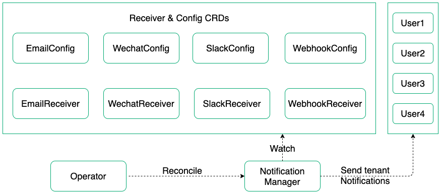
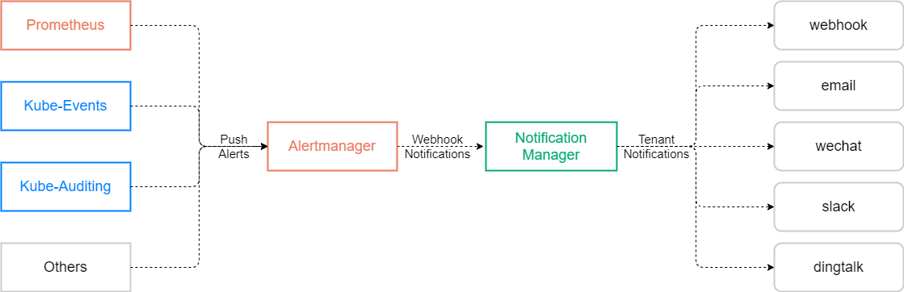

# Notification Manager
Notification Manager manages notifications in multi-tenant K8s environment. It receives alerts or notifications from different senders and then send notifications to various tenant receivers based on alerts/notifications' tenant label like "namespace". 

Supported senders includes:
- Prometheus Alertmanager
- Custom sender (Coming soon)

Supported receivers includes:
- Email
- [Wechat Work](https://work.weixin.qq.com/)
- Slack 
- Webhook (Coming soon)

## Architecture
Notification Manager uses CRDs to store notification configs like email, wechat and slack. It also includes an operator to create and reconcile NotificationManager CRD which watches all notification config CRDs, updates notification settings accordingly and sends notifications to users.



## Integration with Alertmanager
Notification Manager could receive webhook notifications from Alertmanager and then send notifications to users in a multi-tenancy way.



## CustomResourceDefinitions
Notification Manager uses the following CRDs to define the desired alerts/notifications webhook and receiver configs:
- NotificationManager: Defines the desired alerts/notification webhook deployment. The Notification Manager Operator ensures a deployment meeting the resource requirements is running.
- EmailConfig: Defines the email configs like SmartHost, AuthUserName, AuthPassword, From, RequireTLS etc. 
- EmailReceiver: Define email receiver's mail addresses and the EmailConfig selector.
- WechatConfig: Define the wechat configs like ApiUrl, ApiCorpId, AgentId and ApiSecret. 
- WechatReceiver: Define the wechat receiver related info like ToUser, ToParty, ToTag as well as WechatConfig Selector.
- SlackConfig: Define the slack configs like SlackTokenSecret.
- SlackReceiver: Define the slack channel to send notifications to and the SlackConfig selector.
- WebhookConfig: Define the webhook Url, HttpConfig.
- WebhookReceiver: Define the WebhookConfig selector.

The relationship between receivers and configs can be demostrated as below:


Receiver CRDs like EmailReceiver, WechatReceiver, SlackReceiver and WebhookReceiver can be categorized into 2 types `global` and `tenant` by label like `type = global`, `type = tenant` :
- A global EmailReceiver receives all alerts and then send notifications regardless tenant info(user or namespace).
- A tenant EmailReceiver receives alerts with specified tenant label like `user` or `namespace` 

Usually alerts received from Alertmanager contains a `namespace` label, Notification Manager uses this label to decide which receiver to use for sending notifications:
- For KubeSphere, Notification Manager will try to find workspace `user` in that `namespace`'s rolebinding and then find receivers with `user = xxx` label.
- For other Kubernetes cluster, Notification Manager will try to find receivers with `namespace = xxx` label. 

For alerts without a `namespace` label, for example alerts of node or kubelet, user can setup a receiver with `type = global` label to receive alerts without a `namespace` label. A global receiver sends notifications for all alerts received regardless any label. A global receiver is usually set for a admin role.

Config CRDs like EmailConfig, WechatConfig, SlackConfig, WebhookConfig can be categorized into 2 types `tenant` and `default` by label like `type = tenant`, `type = default`:
- Tenant EmailConfig is to be selected by a tenant EmailReceiver which means each tenant can have his own EmailConfig. 
- If no EmailConfig selector is configured in a EmailReceiver, then this EmailReceiver will try to find a `default` EmailConfig. Usually admin will set a global default config.

A receiver could be configured without xxxConfigSelector, in which case Notification Manager will try to find a default xxxConfigSelector with `type = default` label, for example:
- A global EmailReceiver with `type = global` label should always use the default EmailConfig which means emailConfigSelector needn't to be configured for a global EmailReceiver and one default EmailConfig with `type = default` label needs to be configured for all global EmailReceivers.  
- Usually a tenant EmailReceiver with `type = tenant` label could have its own tenant emailConfigSelector to find its tenant EmailConfig with `type = tenant` label.
- A tenant EmailReceiver with `type = tenant` label can also be configured without a emailConfigSelector, in which case Notification Manager will try to find the default EmailConfig with `type = default` label for this tenant EmailReceiver.

## QuickStart

Deploy CRDs and the Notification Manager Operator:

```shell
kubectl apply -f config/bundle.yaml
```

### Deploy Notification Manager in KubeSphere (Uses `workspace` to distinguish each tenant user):

#### Deploy Notification Manager
```shell
cat <<EOF | kubectl apply -f -
apiVersion: notification.kubesphere.io/v1alpha1
kind: NotificationManager
metadata:
  name: notification-manager
  namespace: kubesphere-monitoring-system
spec:
  replicas: 1
  resources:
    limits:
      cpu: 500m
      memory: 1Gi
    requests:
      cpu: 100m
      memory: 20Mi
  image: kubesphere/notification-manager:v0.1.0
  imagePullPolicy: IfNotPresent
  serviceAccountName: notification-manager-sa
  portName: webhook
  notificationManagerNamespaces:
  - kubesphere-monitoring-system
  defaultConfigSelector:
    matchLabels:
      type: default
  receivers:
    tenantKey: user
    globalReceiverSelector:
      matchLabels:
        type: global
    tenantReceiverSelector:
      matchLabels:
        type: tenant
    options:
      email:
        notificationTimeout: 5
        deliveryType: bulk
        maxEmailReceivers: 200
      wechat:
        notificationTimeout: 5
      slack:
        notificationTimeout: 5
EOF
```

#### Deploy the default EmailConfig and a global EmailReceiver
```
cat <<EOF | kubectl apply -f -
apiVersion: notification.kubesphere.io/v1alpha1
kind: EmailConfig
metadata:
  labels:
    app: notification-manager
    type: default
  name: default-email-config
  namespace: kubesphere-monitoring-system
spec:
  authPassword:
    key: password
    name: default-email-secret
    namespace: kubesphere-monitoring-system
  authUsername: sender1 
  from: sender1@xyz.com
  requireTLS: true
  smartHost:
    host: imap.xyz.com
    port: "25"
---
apiVersion: notification.kubesphere.io/v1alpha1
kind: EmailReceiver
metadata:
  labels:
    app: notification-manager
    type: global
  name: global-email-receiver
  namespace: kubesphere-monitoring-system
spec:
  # emailConfigSelector needn't to be configured for a global receiver
  to:
  - receiver1@xyz.com
  - receiver2@xyz.com
---
apiVersion: v1
data:
  password: dGVzdA==
kind: Secret
metadata:
  labels:
    app: notification-manager
  name: default-email-secret
  namespace: kubesphere-monitoring-system
type: Opaque
EOF
```

#### Deploy a tenant EmailConfig and a EmailReceiver
```
cat <<EOF | kubectl apply -f -
apiVersion: notification.kubesphere.io/v1alpha1
kind: EmailConfig
metadata:
  labels:
    app: notification-manager
    type: tenant
    user: user1 
  name: user1-email-config
  namespace: kubesphere-monitoring-system
spec:
  authPassword:
    key: password
    name: default-email-secret
    namespace: kubesphere-monitoring-system
  authUsername: sender1 
  from: sender1@xyz.com
  requireTLS: true
  smartHost:
    host: imap.xyz.com
    port: "25"
---
apiVersion: notification.kubesphere.io/v1alpha1
kind: EmailReceiver
metadata:
  labels:
    app: notification-manager
    type: tenant
    user: user1
  name: user1-email-receiver
  namespace: kubesphere-monitoring-system
spec:
  # This emailConfigSelector could be omitted in which case a defalut EmailConfig should be configured
  emailConfigSelector:
    matchLabels:
      type: tenant
      user: user1 
  to:
  - receiver1@xyz.com
  - receiver2@xyz.com
---
apiVersion: v1
data:
  password: dGVzdA==
kind: Secret
metadata:
  labels:
    app: notification-manager
  name: default-email-secret
  namespace: kubesphere-monitoring-system
type: Opaque
EOF
```

#### Deploy the default WechatConfig and a global WechatReceivers

```
cat <<EOF | kubectl apply -f -
apiVersion: notification.kubesphere.io/v1alpha1
kind: WechatConfig
metadata:
  name: default-wechat-config
  namespace: kubesphere-monitoring-system
  labels:
    app: notification-manager
    type: default
spec:
  wechatApiUrl: < wechat-api-url >
  wechatApiSecret:
    key: wechat
    name: < wechat-api-secret >
  wechatApiCorpId: < wechat-api-corp-id >
  wechatApiAgentId: < wechat-api-agent-id >
---
apiVersion: notification.kubesphere.io/v1alpha1
kind: WechatReceiver
metadata:
  name: global-wechat-receiver
  namespace: kubesphere-monitoring-system
  labels:
    app: notification-manager
    type: global 
spec:
  # wechatConfigSelector needn't to be configured for a global receiver
  # optional
  # One of toUser, toParty, toParty should be specified.
  toUser: < wechat-user >
  toParty: < wechat-party >
  toTag: < wechat-tag >
---
apiVersion: v1
data:
  wechat: dGVzdA==
kind: Secret
metadata:
  labels:
    app: notification-manager
  name: < wechat-api-secret >
  namespace: kubesphere-monitoring-system
type: Opaque
EOF
```
> wechatApiAgentId is the id of app which sends message to user in your Wechat Work
> wechatApiSecret is the secret of this app
> You can get these two parameters in App Managerment of your Wechat Work. 
> Note that any user, party or tag who wants to receive notifications must be in the allowed users list of this app.

#### Deploy the default SlackConfig and a global SlackReceiver

```
cat <<EOF | kubectl apply -f -
apiVersion: notification.kubesphere.io/v1alpha1
kind: SlackConfig
metadata:
  name: default-slack-config
  namespace: kubesphere-monitoring-system
  labels:
    app: notification-manager
    type: default
spec:
  slackTokenSecret: 
    key: token
    name: < slack-token-secret >
---
apiVersion: notification.kubesphere.io/v1alpha1
kind: SlackReceiver
metadata:
  name: global-slack-receiver
  namespace: kubesphere-monitoring-system
  labels:
    app: notification-manager
    type: global
spec:
  # slackConfigSelector needn't to be configured for a global receiver
  channel: < slack-channel >
---
apiVersion: v1
data:
  token: dGVzdA==
kind: Secret
metadata:
  labels:
    app: notification-manager
  name: < slack-token-secret >
  namespace: kubesphere-monitoring-system
type: Opaque
EOF
```
> Slack token is the OAuth Access Token or Bot User OAuth Access Token when you create a slack app. This app must have the scope chat:write. The user who creates the app or bot user must be in the channel which you want to send notification to.

### Deploy Notification Manager in any other Kubernetes cluster (Uses `namespace` to distinguish each tenant user):
Deploy Notification Manager
```shell
cat <<EOF | kubectl apply -f -
apiVersion: notification.kubesphere.io/v1alpha1
kind: NotificationManager
metadata:
  name: notification-manager
  namespace: default
spec:
  replicas: 1
  resources:
    limits:
      cpu: 500m
      memory: 1Gi
    requests:
      cpu: 100m
      memory: 20Mi
  image: kubesphere/notification-manager:v0.1.0
  imagePullPolicy: IfNotPresent
  serviceAccountName: notification-manager-sa
  portName: webhook
  notificationManagerNamespaces:
  - default
  defaultConfigSelector:
    matchLabels:
      type: default
  receivers:
    tenantKey: namespace
    globalReceiverSelector:
      matchLabels:
        type: global
    tenantReceiverSelector:
      matchLabels:
        type: tenant
    options:
      email:
        notificationTimeout: 5
        deliveryType: bulk
        maxEmailReceivers: 200
      wechat:
        notificationTimeout: 5
      slack:
        notificationTimeout: 5
EOF
```

#### Deploy the default EmailConfig and a global EmailReceiver
```
cat <<EOF | kubectl apply -f -
apiVersion: notification.kubesphere.io/v1alpha1
kind: EmailConfig
metadata:
  labels:
    app: notification-manager
    type: default
  name: default-email-config
  namespace: default
spec:
  authPassword:
    key: password
    name: default-email-secret
    namespace: default
  authUsername: sender1
  from: sender1@xyz.com
  requireTLS: true
  smartHost:
    host: imap.xyz.com
    port: "25"
---
apiVersion: notification.kubesphere.io/v1alpha1
kind: EmailReceiver
metadata:
  labels:
    app: notification-manager
    type: global
  name: global-email-receiver
  namespace: default
spec:
  # emailConfigSelector needn't to be configured for a global receiver
  to:
  - receiver1@xyz.com
  - receiver2@xyz.com
---
apiVersion: v1
data:
  password: dGVzdA==
kind: Secret
metadata:
  labels:
    app: notification-manager
  name: default-email-secret
  namespace: default
type: Opaque
EOF
```

#### Deploy tenant EmailConfig and EmailReceiver
```
cat <<EOF | kubectl apply -f -
apiVersion: notification.kubesphere.io/v1alpha1
kind: EmailConfig
metadata:
  labels:
    app: notification-manager
    type: tenant
    namespace: default
  name: user1-email-config
  namespace: default
spec:
  authPassword:
    key: password
    name: user1-email-secret
    namespace: default
  authUsername: sender1 
  from: sender1@xyz.com
  requireTLS: true
  smartHost:
    host: imap.xyz.com
    port: "25"
---
apiVersion: notification.kubesphere.io/v1alpha1
kind: EmailReceiver
metadata:
  labels:
    app: notification-manager
    type: tenant
    namespace: default
  name: user1-email-receiver
  namespace: default
spec:
  emailConfigSelector:
    matchLabels:
      type: tenant
      namespace: default
  to:
  - receiver3@xyz.com
  - receiver4@xyz.com
---
apiVersion: v1
data:
  password: dGVzdA==
kind: Secret
metadata:
  labels:
    app: notification-manager
  name: user1-email-secret
  namespace: default
type: Opaque
EOF
```

#### Deploy the default WechatConfig and a global WechatReceiver

```
cat <<EOF | kubectl apply -f -
apiVersion: notification.kubesphere.io/v1alpha1
kind: WechatConfig
metadata:
  name: default-wechat-config
  namespace: default
  labels:
    app: notification-manager
    type: default
spec:
  wechatApiUrl: < wechat-api-url >
  wechatApiSecret:
    key: wechat
    name: < wechat-api-secret >
  wechatApiCorpId: < wechat-api-corp-id >
  wechatApiAgentId: < wechat-api-agent-id >
---
apiVersion: notification.kubesphere.io/v1alpha1
kind: WechatReceiver
metadata:
  name: global-wechat-receiver
  namespace: default
  labels:
    app: notification-manager
    type: global
spec:
  # wechatConfigSelector needn't to be configured for a global receiver
  # optional
  # One of toUser, toParty, toParty should be specified.
  toUser: < wechat-user >
  toParty: < wechat-party >
  toTag: < wechat-tag >
---
apiVersion: v1
data:
  wechat: dGVzdA==
kind: Secret
metadata:
  labels:
    app: notification-manager
  name: < wechat-api-secret >
  namespace: default
type: Opaque
EOF
```

#### Deploy the default SlackConfig and a global SlackReceiver

```
cat <<EOF | kubectl apply -f -
apiVersion: notification.kubesphere.io/v1alpha1
kind: SlackConfig
metadata:
  name: default-slack-config
  namespace: default
  labels:
    app: notification-manager
    type: default
spec:
  slackTokenSecret: 
    key: token
    name: < slack-token-secret >
---
apiVersion: notification.kubesphere.io/v1alpha1
kind: SlackReceiver
metadata:
  name: global-slack-receiver
  namespace: default
  labels:
    app: notification-manager
    type: global
spec:
  # slackConfigSelector needn't to be configured for a global receiver
  channel: < slack-channel >
---
apiVersion: v1
data:
  token: dGVzdA==
kind: Secret
metadata:
  labels:
    app: notification-manager
  name: < slack-token-secret >
  namespace: default
type: Opaque
EOF
```

### Config Prometheus Alertmanager to send alerts to Notification Manager
Notification Manager use port `19093` and API path `/api/v2/alerts` to receive alerts sending from Prometheus Alertmanager.
To receive Alertmanager alerts, add webhook config like below to the `receivers` section of Alertmanager configuration file:

```shell
    "receivers":
     - "name": "notification-manager"
       "webhook_configs":
       - "url": "http://notification-manager-svc.kubesphere-monitoring-system.svc:19093/api/v2/alerts"
```

## Development

```
# Build notification-manager-operator and notification-manager docker images
make build 
# Push built docker images to docker registry
make push
```
